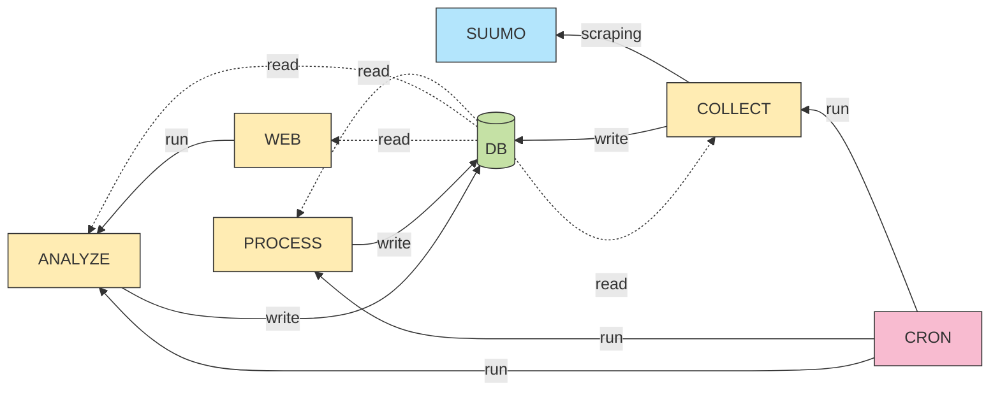

# CLAUDE.md

This file provides guidance to Claude Code (claude.ai/code) when working with code in this repository.

IMPORTANT: 基本的に日本語での応答をお願いする. 「。」は嫌いなので、「. 」ピリオド＆半角スペース(文末ではなく、文中の場合)を代用する.
NEVER: 「->」は使用禁止.「->」で代用する.

## Project Overview

このリポジトリでは日本の不動産データを扱う. データはの日本のWEBサイト「SUUMO」からスクレイピングされている.
スクレイピングされたデータを整理し、分析を行い、不動産購入目的のために利活用する.

### Purpose & Goals

スクレイピングされた日本の不動産データを整理・分析し、私個人が有効に不動産を購入する事である.
このプロジェクトが完成された場合、以下の機能を有する.

- データスクレイピング（完成済）
- データクレンジング及び分析可能な項目整理
- 多数の分析関数
- 分析行為及び分析結果を視覚的に確認可能なWebページ

### Technology Stack

このプロジェクトで用いられる技術スタックは以下. 

- Python
- React（未実装）
- Database ( PostgreSQL )
- Cron
- Docker

この環境とは別に、Virtual Private Server ( VPS ) 上で既にデータスクレイピング処理が動いている.
VPSのホスト側でCron起動されたPythonが常時実行され、Docker container として起動している PostgreSQL に読み書きを行っている.

#### Python Dependencies

`pyproject.toml` で管理される主要な依存パッケージ：

**データベース関連**
- `kkpsgre`: PostgreSQL操作用のカスタムライブラリ
- 使用目的: データベース接続、クエリ実行

**データ処理関連**
- `kkdf`: データフレーム処理用のカスタムライブラリ
- `pandas==2.2.3`: データ分析・操作
- `numpy==2.2.1`: 数値計算
- `polars==1.18.0`: 高速データフレーム処理
- `pyarrow==19.0.1`: 列指向データ処理

**ウェブスクレイピング関連**
- `requests==2.32.3`: HTTP リクエスト
- `beautifulsoup4==4.12.3`: HTML/XML パース

**並列処理関連**
- `joblib==1.4.2`: 並列計算・キャッシュ

### Key Features

時系列的に定点観測された日本全国の不動産データを用いた分析が可能である.

### Target Users

今のところ、私個人のみである. もしかしたらサービス展開する可能性はある.

## Project Structure

### Directory Layout

```
├── .claude
├── CLAUDE.md
├── README.md      # プロジェクト概要や、サービス構築手順など.
├── kkestate       # 共通して使われる class や function はここで管理される
│   ├── config     # データベース接続などの設定用ファイル
│   └── util       # 共通した処理が関数化されて管理される
├── main           # サービスインストールや実行に必要なファイル群
│   ├── analyze    # データ分析
│   ├── collect    # データ収集
│   ├── database   # データベースに関連するファイル. schema など
│   ├── log        # サービス実行時のログが格納される. 基本的に空
│   ├── others     # その他ファイル. crontab など
│   ├── process    # 収集されたデータの後処理. データクレンジングや項目整理など
│   └── web        # データ分析及び結果を確認するためのWeb画面
├── pyproject.toml # Python の依存パッケージの記述
├── tests          # テスト用プログラム
└── venv           # pyproject.toml を元に作成された仮想環境. `pyhton -m venv venv & source .venv/bin/activate & pip install -e .` で実行された後の状態
```

NEVER: 上述のディレクトリ構造は保ち、新規ディレクトリの作成は禁ずる.

### File Organization

#### Core Packages

- **kkestate/**: 共通ライブラリパッケージ
  - `config/`: 設定管理モジュール（DB接続設定など）
  - `util/`: 汎用ユーティリティ関数

#### Application Modules

- **main/collect/**: データ収集モジュール
  - スクレイピングロジック

- **main/process/**: データ処理モジュール
  - データクレンジング
  - 項目整理・変換処理

- **main/analyze/**: データ分析モジュール
  - 統計分析関数
  - 価格予測モデル

- **main/web/**: Webインターフェース
  - React フロントエンド
  - API エンドポイント

#### Module Dependencies

- `main/*` モジュールは `kkestate` パッケージに依存
- 各モジュールは独立して動作可能な設計
- データフローは collect -> process -> analyze -> web の順序
- 基本的に各フローは並列に動作し、データベースで間接的にステータス管理され、データフローが構築される

### Naming Conventions

Python については、既存のモジュールを確認した上で私の好みを理解し、それに可能な限り習うようにする.
その他については一任する.

## Development Setup

IMPORTANT: 本環境は本番環境ではない.
IMPORTANT: 本番環境のデータベースはMCPで接続されているが、あなたは読み取り権限しか与えられない. そのため、新規 schema 作成などは私が行う必要がある.

### Prerequisites

- Ubuntu OS

### Python Setup

```bash
cd myproject
python -m venv venv
source venv/bin/activate
pip install -e .
```

## Common Commands

### Build & Run

`./README.md` に記述あり.

### Testing

`test/` 内の実行モジュールを実行.

### Deployment

`./README.md` に記述あり.

### Database Operations

`./README.md` に記述あり.

## Architecture

### System Design



### Data Flow

1. COLLECT
    1. `estate_tmp` をクリアする.
    2. `SUUMO` には大項目としての「都道府県」や「新築/中古」などの項目があり、そのページには各物件が何ページにも渡ってリスト化されている. まずはそれらページに直接アクセスできるようなURL_Aを編集作成し、`estate_tmp` に書き込む.
    3. `estate_tmp` から `is_checked = false` な URL_A を参照し、そのページにリスト化されている物件の詳細情報を取得するための URL_B を抽出する.
    4. URA_A ページにある各物件について情報を取得できた場合は、`estate_tmp` の該当レコードの `is_checked` を true にする.
    5. ある URL_B は1物件に対して一意であるとし、`estate_main` に URL_B が存在しない場合は URL_B の情報を書き込む. 存在する場合は、`sys_updated` のみが update される. この処理において、URL_B と一意に対応する `id` は自動採番される.
    6. `estate_main` の情報を取得し、各物件の詳細情報を URL_B から取得する. 
    7. 各物件の詳細情報の取得可否については `estate_run` で管理され、詳細情報取得処理が走れば `estate_run` にレコードが追加される. `estate_run` の `id` は自動採番される.
    8. 詳細情報は `key` と `value` で保持され、それらはピュアにスクレイピングされたテキスト情報であり、未クレンジングな状態である. `key` の名前は `estate_mst_key` で管理され、新規の名前の場合は登録され、`id` が自動採番される.
    9. 詳細情報は `estate_detail` に記録され、その際、`estate_mst_key` で管理される `id` に置き換えて記録される. ただし、前回記録されたデータと `key` と `value` 単位で同じデータであった場合、その項目は記録されない. 要は差異がある場合のみ記録される仕組みになっている.
    10. 正しく記録できた場合は、`estate_run` の `is_success` を true にする.
2. PROCESS
  未実装
3. ANALYZE
  未実装
4. WEB
  未実装

### Key Components

### Database Schema

プロジェクトでは以下の5つのテーブルを使用している：

1. **`estate_tmp`** - 一時的なURL管理テーブル
   - `url` (text, NOT NULL): スクレイピング対象のURL
   - `is_checked` (boolean, NOT NULL, default: false): 処理済みフラグ
   - `sys_updated` (timestamp, NOT NULL, default: CURRENT_TIMESTAMP): 更新日時

2. **`estate_main`** - 物件の基本情報テーブル
   - `id` (bigint, NOT NULL, PK): 自動採番ID
   - `name` (text): 物件名
   - `url` (text, NOT NULL): 物件詳細ページのURL（一意）
   - `sys_updated` (timestamp, NOT NULL, default: CURRENT_TIMESTAMP): 更新日時

3. **`estate_run`** - 実行履歴管理テーブル
   - `id` (bigint, NOT NULL, PK): 自動採番ID
   - `id_main` (bigint, NOT NULL): estate_mainのIDへの参照
   - `is_success` (boolean, NOT NULL, default: false): 実行成功フラグ
   - `timestamp` (timestamp): 実行日時

4. **`estate_mst_key`** - 項目名マスタテーブル
   - `id` (smallint, NOT NULL, PK): 自動採番ID
   - `name` (text, NOT NULL): 項目名（スクレイピングで取得されるキー）
   - `sys_updated` (timestamp, NOT NULL, default: CURRENT_TIMESTAMP): 更新日時

5. **`estate_detail`** - 物件詳細情報テーブル
   - `id_run` (bigint, NOT NULL): estate_runのIDへの参照
   - `id_key` (smallint, NOT NULL): estate_mst_keyのIDへの参照
   - `value` (text): 項目の値（スクレイピングで取得される生データ）

### External Services

## Coding Guidelines

特に無いが、既存のコード様式を Follow して.

## Development Workflow

### Git Workflow

1. **基本フロー**
  - 作業前に必ず最新の main ブランチを pull
  - 機能開発は feature ブランチで行う
  - コミットは小さく、頻繁に行う
  - push 前にローカルでテストを実行

2. **コミット前の確認事項**
  - 不要なデバッグコードの削除
  - 秘密情報（パスワード、APIキー）が含まれていないか確認
  - コードフォーマットの統一

### Branch Strategy

1. **ブランチ命名規則**
  - feature/機能名 - 新機能開発
  - fix/バグ名 - バグ修正
  - refactor/対象名 - リファクタリング
  - docs/文書名 - ドキュメント更新

2. **ブランチ運用**
  - main: 本番環境相当の安定版
  - develop: 開発中の最新版（使用する場合）
  - feature/*: 各機能開発用
  - 長期間のブランチは定期的に main をマージ

### PR Process

1. **PR作成前**
  - ローカルでのテスト完了
  - コンフリクトの解消
  - 不要なファイルの除外

2. **PR作成時**
  - タイトルは変更内容を簡潔に記載
  - 本文には以下を含める：
    - 変更の概要
    - 変更理由
    - テスト方法
    - 関連するIssue番号（あれば）

3. **マージ条件**
  - レビュー承認
  - CI/CDパス（設定されている場合）
  - コンフリクトなし

### Review Guidelines

1. **レビュー観点**
  - コードの可読性
  - パフォーマンスへの影響
  - セキュリティリスク
  - 既存機能への影響
  - テストの妥当性

2. **フィードバック方法**
  - 具体的な改善案を提示
  - 必須修正と推奨事項を区別
  - 良い点も積極的にコメント

3. **レビュー対応**
  - フィードバックには迅速に対応
  - 修正内容はコミットメッセージで明確化
  - 議論が必要な場合はコメントで返信

## Testing

IMPORTANT: テスト用のコードは `test/*` に書いて.

### Test Structure

### Running Tests

### Writing Tests

## Troubleshooting

### Common Issues

### Debug Tips

## Important Notes

### Database

- データのSELECT には必ず LIMIT をつける事. LIMIT 100 でまずは様子をみつつ、その取得時間が10秒以内である場合は、LIMIT を x5 ずつして許容量を上げていく. 基本的にクエリは 10秒以内に終了される事.
- 初手の JOINS は避ける. まずは LIMIT をつけて単体のテーブルデータを確認する事.
- 複雑な JOIN クエリは避ける事。なるべくシンプルなSQLを組み合わせて python モジュールの中で joins させるなどする.