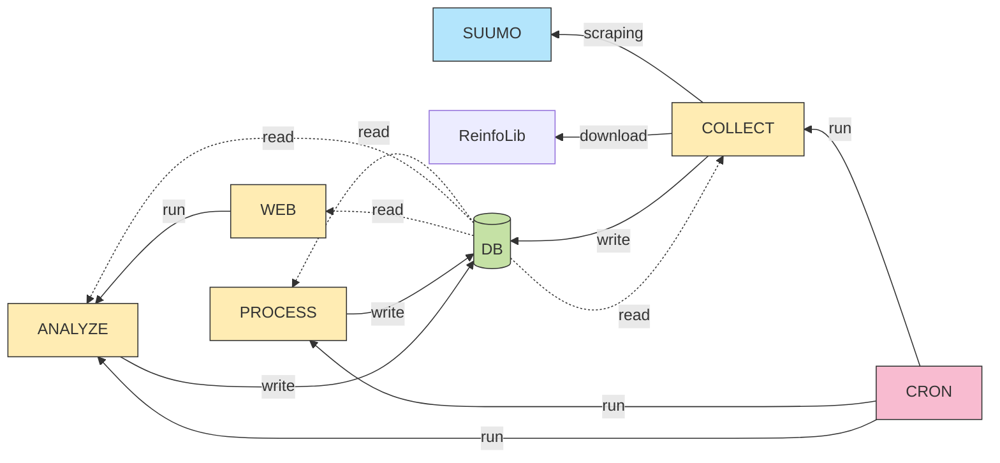

# kkestate

Collecting real estate data, analysing and visualization.

# Overview 

### System Design



# Setup

### Server Basic setup

Basically, it follows below.

see: [kkenv](https://github.com/kazukingh01/kkenv/blob/3f30366d3d3eb34f16e04999266fd767172e3e6e/ubuntu/README.md#server-basic-setup)

```bash
sudo mkdir /home/share
sudo chown -R ubuntu:ubuntu /home/share/
```

### Python

```bash
INSTALL_PYTHON_VERSION="3.12.8"
```

see: [kkenv](https://github.com/kazukingh01/kkenv/blob/3f30366d3d3eb34f16e04999266fd767172e3e6e/ubuntu/README.md#python)

### Git clone

```bash
cd ~
python -m venv venv
source ~/venv/bin/activate
git clone https://github.com/kazukingh01/kkestate.git
pip install -e ~/kkestate/
```

##### Copy files

```bash
cp ~/kkestate/main/database/schema.collect.sql   /home/share/
cp ~/kkestate/main/database/schema.process.sql   /home/share/
cp ~/kkestate/main/database/schema.reinfolib.sql /home/share/
cp ~/kkestate/main/database/schema.location.sql  /home/share/
cp ~/kkestate/main/database/view.sql             /home/share/
```

### Database

Make PostgreSQL container.

```bash
POSTGRESQL_VER="17.4"
```

see: [Install ( Docker Hub Base )](https://github.com/kazukingh01/kkpsgre/tree/893ec74a50904a891323e58876e06dfec3491ea2?tab=readme-ov-file#install--docker-hub-base-)


##### Recreate Database & Tables

```bash
sudo docker exec --user=postgres postgres dropdb estate
sudo docker exec --user=postgres postgres createdb --encoding=UTF8 --locale=ja_JP.utf8 --template=template0 estate
sudo docker exec --user=postgres postgres psql -U postgres -d estate -f /home/share/schema.collect.sql
sudo docker exec --user=postgres postgres psql -U postgres -d estate -f /home/share/schema.process.sql
sudo docker exec --user=postgres postgres psql -U postgres -d estate -f /home/share/schema.reinfolib.sql
sudo docker exec --user=postgres postgres psql -U postgres -d estate -f /home/share/schema.location.sql
sudo docker exec --user=postgres postgres psql -U postgres -d estate -f /home/share/view.sql
```

##### Restore Database

```bash
sudo docker exec --user=postgres postgres dropdb estate
sudo docker exec --user=postgres postgres createdb --encoding=UTF8 --locale=ja_JP.utf8 --template=template0 estate
sudo docker exec --user=postgres postgres pg_restore -d estate /home/share/db_YYYYMMDD.dump
```

##### Add user "guest"

see: [Add user "guest"](https://github.com/kazukingh01/kkpsgre/tree/2d66939e01ea81ae6b255448a80875a589b8e376?tab=readme-ov-file#add-guest-user)

##### Set config

```bash
vi ~/kkestate/kkestate/config/psgre.py
```

### Cron

```bash
sudo cp /etc/crontab /etc/crontab.`date "+%Y%m%d%H%M%S"`
cat ~/kkestate/main/others/crontab | sudo tee -a /etc/crontab
sudo /etc/init.d/cron restart
```

# [ Feature ] Collect

see: [README](./main/collect/README.md)

# [ Feature ] Process

see: [README](./main/process/README.md)

# [ Feature ] Analyze

see: [README](./main/analyze/README.md)

# [ Feature ] Web

see: [README](./main/web/README.md)
