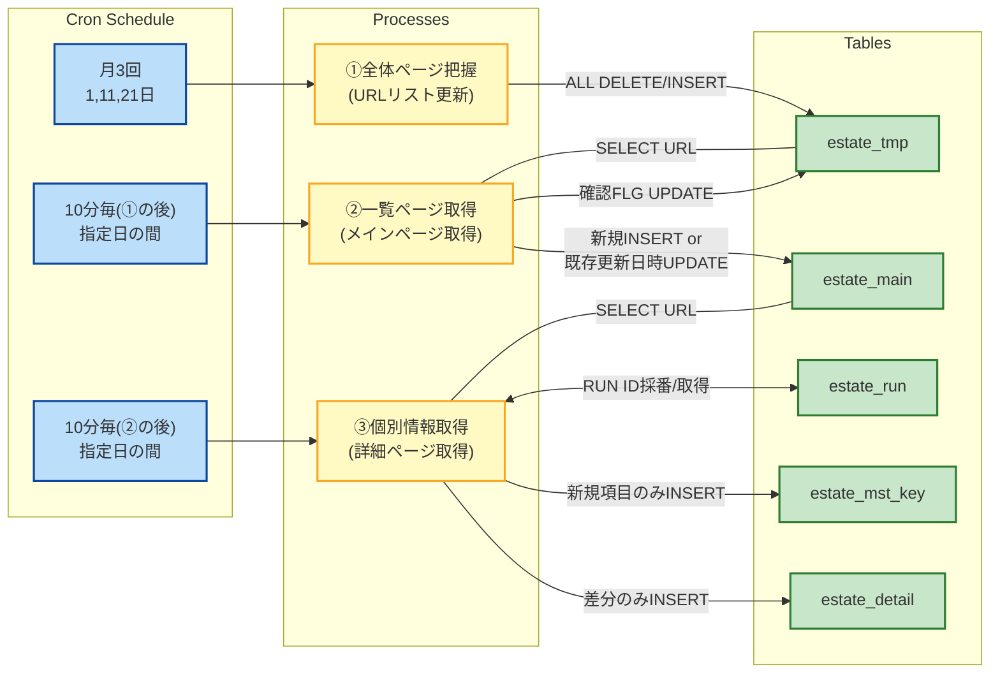
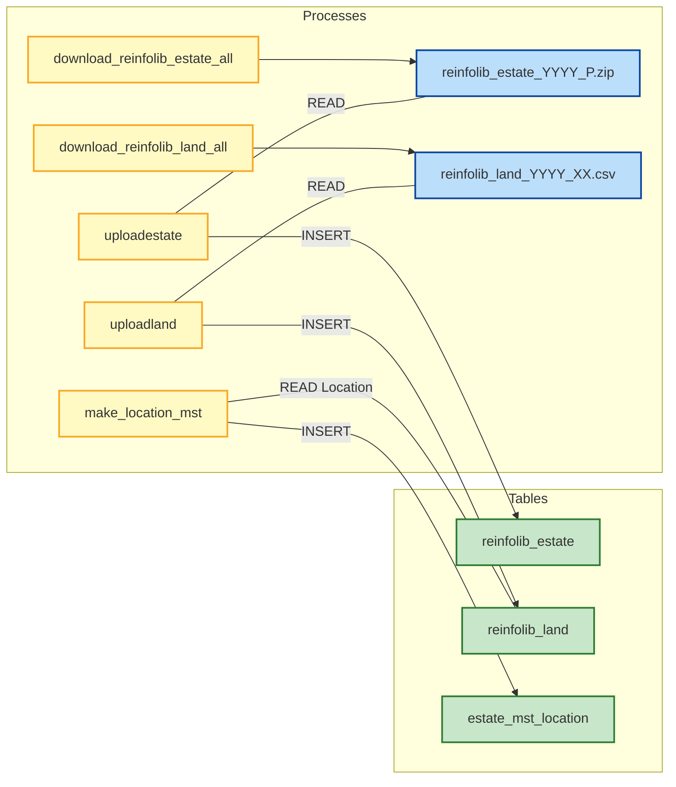

# Purpose

Collecting real estate data.

- Scraping from "Suumo"
- Downloading from "reinfolib"
- Making location master by using API "https://msearch.gsi.go.jp/address-search/AddressSearch"

# Suumo

### Schedule

see: [crontab](../others/crontab)

### Script

```bash
bash monitor 1
bash monitor 2
bash monitor 3
```

### Workflow



# ReinfoLib

https://www.reinfolib.mlit.go.jp/


### Script

```bash
bash download_reinfolib_estate_all.sh
bash download_reinfolib_land_all.sh
python reinfolib.py uploadestate --download-dir ./downloads --update --skip
python reinfolib.py uploadland   --download-dir ./downloads --update --skip
```

### Workflow


