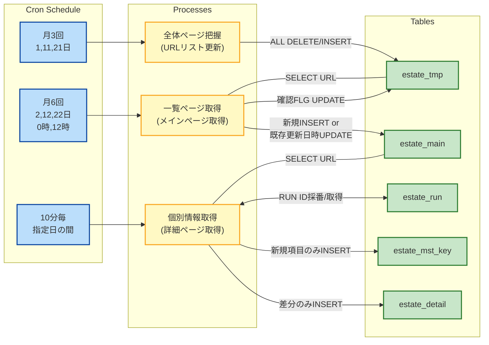

# Purpose

# Workflow

```mermaid
flowchart LR
  %% Cron Schedule
  subgraph CronSchedule["Cron Schedule"]
    C1["月3回<br>1,11,21日"]
    C2["月6回<br>2,12,22日<br>0時,12時"]
    C3["10分毎<br>指定日の間"]
  end

  %% Processes
  subgraph Processes["Processes"]
    P1["全体ページ把握<br>(URLリスト更新)"]
    P2["一覧ページ取得<br>(メインページ取得)"]
    P3["個別情報取得<br>(詳細ページ取得)"]
  end

  %% Tables
  subgraph Tables["Tables"]
    T1["estate_tmp"]
    T2["estate_main"]
    T3["estate_run"]
    T4["estate_mst_key"]
    T5["estate_detail"]
  end

  %% Edges
  C1 --> P1
  C2 --> P2
  C3 --> P3

  P1 --> |ALL DELETE/INSERT| T1
  P2 --- |SELECT URL| T1
  P2 --> |確認FLG UPDATE| T1
  P2 --> |"新規INSERT or<br>既存更新日時UPDATE"| T2
  P3 --- |SELECT URL| T2
  P3 <--> |RUN ID採番/取得| T3
  P3 --> |新規項目のみINSERT| T4
  P3 --> |差分のみINSERT| T5

  %% Styling
  classDef cron    fill:#bbdefb,stroke:#0d47a1,stroke-width:2px;
  classDef process fill:#fff9c4,stroke:#f9a825,stroke-width:2px;
  classDef table   fill:#c8e6c9,stroke:#2e7d32,stroke-width:2px;

  class C1,C2,C3 cron;
  class P1,P2,P3 process;
  class T1,T2,T3,T4,T5 table;
```