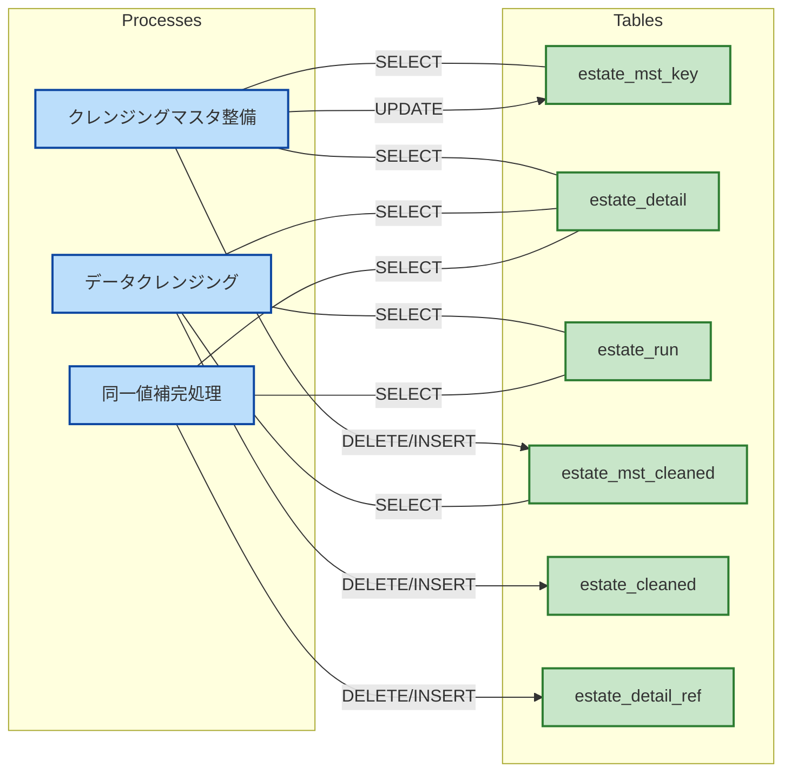

# Purpose

Cleaning data to analyze it efficiently.

# Schedule

see: [crontab](../others/crontab)

# Script

```bash
python process_estate.py stats
python process_estate.py mapping --sample 10000 --unique # --update
python process_estate.py process # --update
python generate_detail_ref.py stats
python generate_detail_ref.py process --limit 500 # --update 
```

# Workflow

